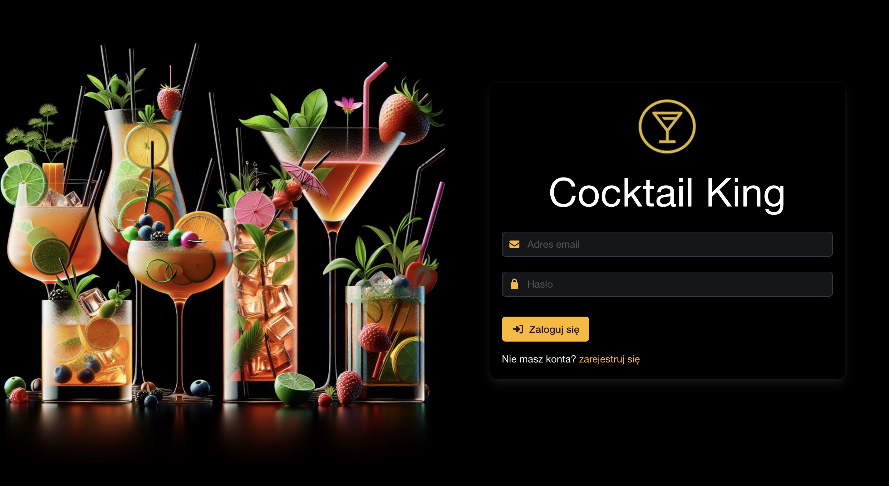
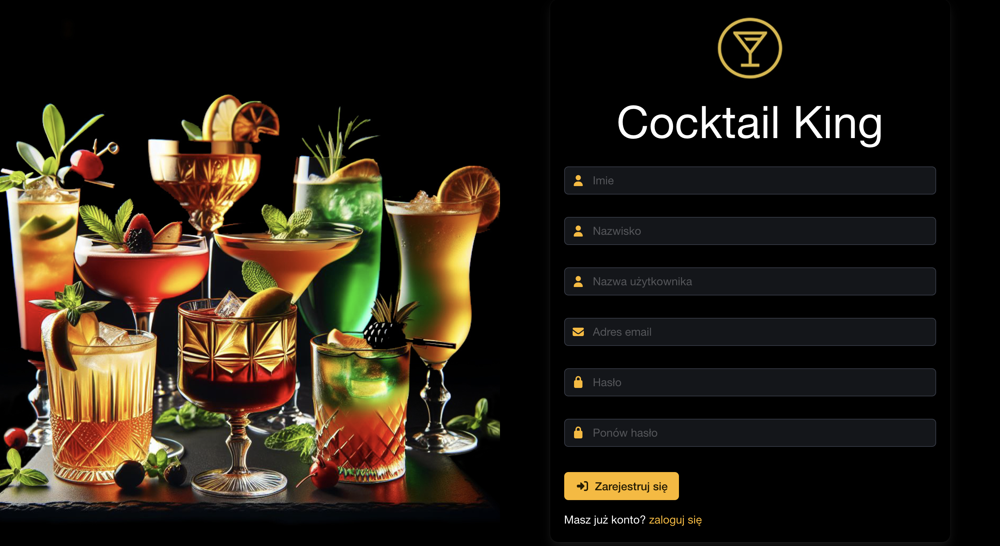
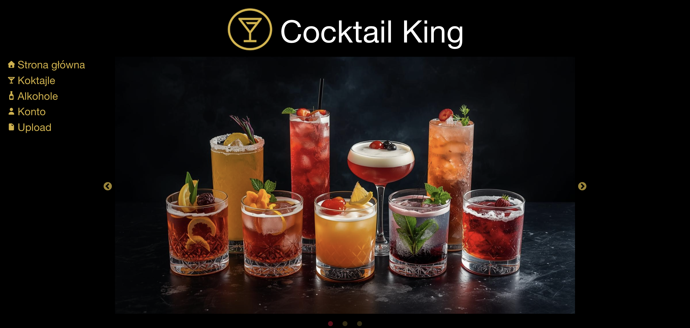
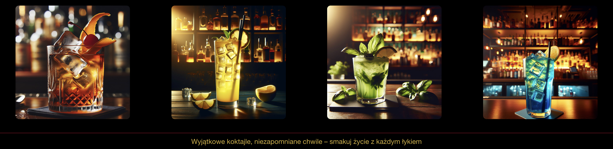
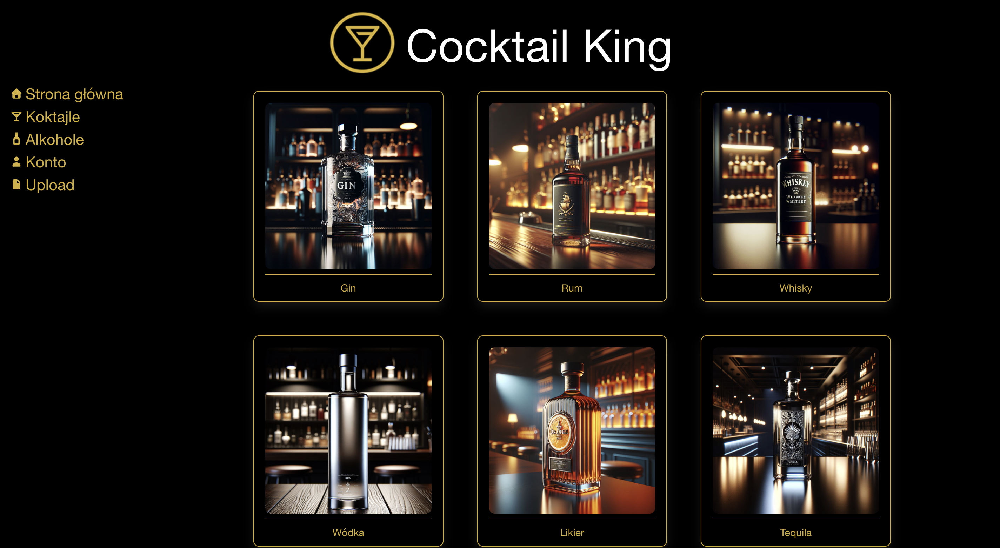
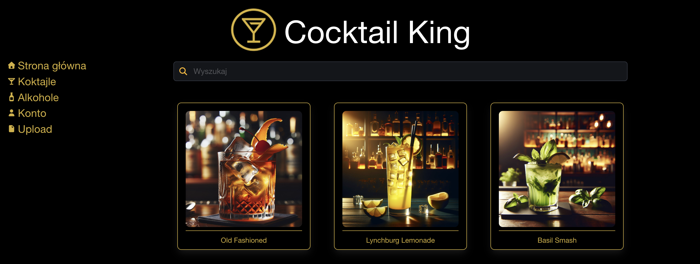
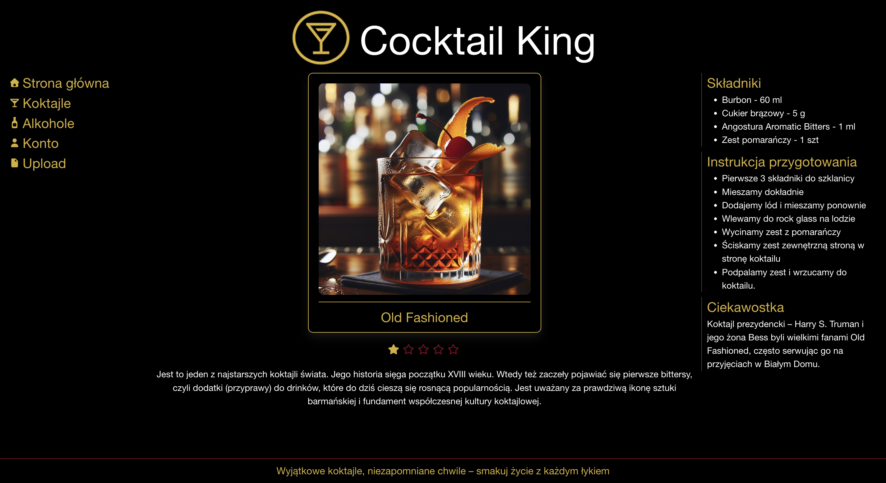
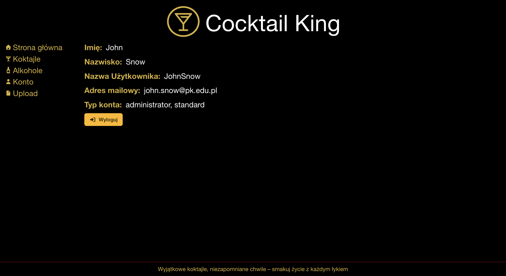
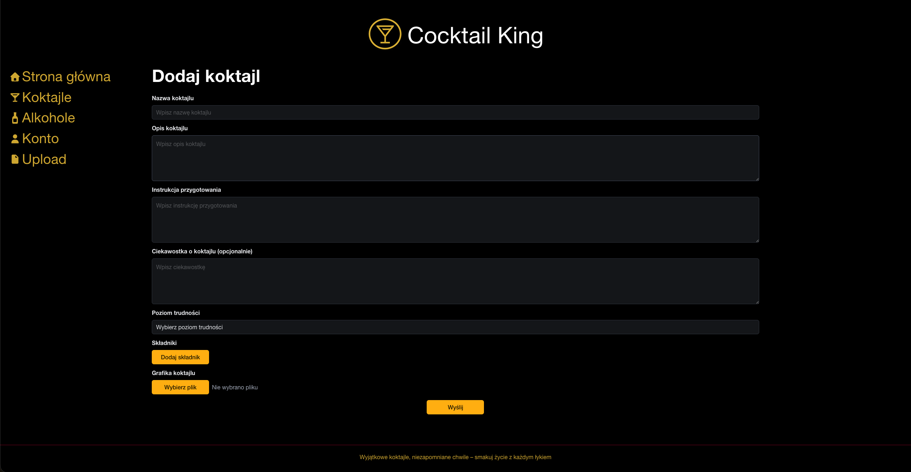
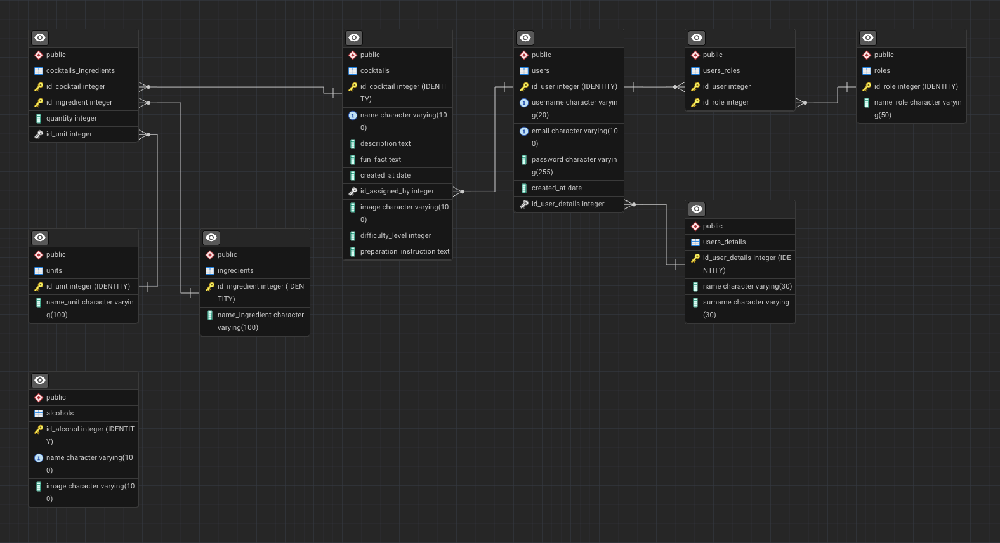

# Cocktail King
Aplikacja stworzona z myślą o miłośnikach koktajli, drinków i szeroko pojętej kultury barmańskiej. To idealne narzędzie zarówno dla amatorów, którzy chcą zaimponować znajomym na imprezie, jak i dla bardziej doświadczonych entuzjastów miksologii. Setki przepisów na koktajle, listy składników, porady barmańskie oraz ciekawostki o pochodzeniu i historii najpopularniejszych alkoholi i koktaili. Dzięki tej aplikacji nie tylko przygotujesz idealnego drinka, ale też zabłyśniesz wiedzą w towarzystwie.

## Wymagania
- Docker zainstalowany na komputerze

## Obsługa
W terminalu, w głównym katalogu projektu, uruchomić kontenery:
- docker-compose up

### Po uruchomieniu:
- Aplikacja dostępna jest pod adresem: http://localhost:8000

### Wyłączenie kontenerów:
- docker-compose down

## Technologie
- Symfony - backend, obsługuje REST API oraz komunikację z bazą danych.
- React - frontend, odpowiada za interfejs użytkownika i konsumpcję API Symfony.
- PostgreSQL - baza danych przechowująca wszystkie dane aplikacji.
- pgAdmin - narzędzie do zarządzania i podglądu bazy danych w PostgreSQL.
- Bulma - lekki, modularny framework CSS oparty na Flexboxie, który umożliwia szybkie tworzenie responsywnych i nowoczesnych interfejsów bez konieczności pisania własnych stylów od podstaw
- Docker - umożliwia uruchamianie wszystkich usług w odizolowanych kontenerach, co ułatwia konfigurację, wdrożenie i testowanie projektu.

Wszystkie komponenty działają w odizolowanych kontenerach Dockerowych i komunikują się w ramach wspólnej sieci (app-network).

## Mechanizm autoryzacji i przekierowań
Aplikacja implementuje kontrolę dostępu i automatyczne przekierowania w zależności od statusu zalogowania użytkownika.

### Użytkownik niezalogowany
Ma dostęp tylko do następujących stron:
- /login – formularz logowania
- /register – rejestracja nowego użytkownika
- /notFound - strona do obsługi strony, której nie odnaleziono
- Próba wejścia na inne strony istniejące w aplikacji powoduje automatyczne przekierowanie na stronę logowania /login

### Użytkownik zalogowany
Ma dostęp do następujących stron:
- /dashboard – strona główna aplikacji.
- /alcohols - strona z alkoholami.
- /cocktails - strona z koktajlami.
- /cocktails/{cocktail_name} - strona dotycząca konkretnego koktajlu.
- /upload - strona do dodawania nowego koktajlu do bazy danych, dostępna jedynie dla administratorów.
- /notFound - strona do obsługi strony, której nie odnaleziono.
- Próba wejścia na /login lub /register powoduje przekierowanie do /dashboard.

## Slider na stronie głównej
- Wyświetla 3 różne slajdy.
- Posiada kropki na dole wskazujące aktualny slajd z możliwością ręcznego przewijania.
- Strzałki boczne umożliwiają ręczne przełączanie slajdów.
- Automatycznie zmienia slajd co 5 sekund.
- Działa w pętli, przewijając slajdy nieskończenie.

## Wyszukiwanie koktajlu
- Strona /cocktails oferuje wyszukiwanie koktajlu według podanej frazy, która jest zawarta w nazwie koktajlu lub w instrukcji przygotwania lub w liście składników.
- Strona samodzielnie po zatwierdzeniu klawiszem "enter" przeładowuje listę koktajli.
- Zresetowanie filtra odbywa się porpzez wpisanie pustej frazy w polu wyszukiwania i zatwierdzeniu klawiszem "enter".

## Rejestracja nowego użytkownika
- Strona dostępna pod adresem /register.
- W celu rejestracji należy uzupełnić wszystkie pola.
- Nazwa użytkownika oraz adres email muszą być unikalne, nie można dodać adresu jeśli już taki istnieje w bazie danych.
- Należy dwukrotnie wpisac takie samo hasło.
- Hasło musi spełniać warunki: min. 8 znaków, min. 1 cyfra, min. 1 znak specjalny.
- Jeśli rejestracja przebiegnie pomyślnie użytkownik otrzymuje komunikat i zostaje przekierowany do strony logowania.

## Logowanie użytkownika
- Strona dostępna pod adresem /login
- Aby zalogować się prawidłowo należy podac adres email oraz hasło.
- Po poprawnym podaniu danych logowania, użytkownik zostaje przekierowany na /dashboard.

## Upload nowych koktajli
- Strona dostępna jedynie dla użytkowników z rolą administrator
- Podczas uplodu podajemy: nazwe koktajlu, opis, instrukcję przygotowania, opcjonalnie ciekawostę, poziom trudności, listę składników oraz plik graficzny miniaturki koktajlu.
- Formularz nie pozwala na dodanie koktajlu o nazwie, która już istnieje w bazie danych.
- Formularz nie pozwala na dodanie koktajlu ze zduplikowanymi skłądnikami na liście.
- Żadne pole oprócz ciekawostki, nie może pozostać pustę.
- Lista składników oraz jednostek jest pobierana z bazy danych.
- Komunikaty o błędach są podawane przy polu, którego błąd dotyczy.
- Zaleca się dodawanie plików graficznych w proporcji 1:1.

## API
Dokumentacja API znajduje się w pliku [OPENAPI](./openapi.yaml)

## Struktura
- docker/ – zawiera pliki Dockerfile i konfiguracje dla poszczególnych technologii.
- symfony/ – kod źródłowy backendu Symfony.
- react/ – kod źródłowy frontend React.
- postgres/ - pliki bazy danych postgreSQL
- docker-compose.yml – definiuje wszystkie kontenery i ich sieci, porty oraz zależności.

## Budowanie i wdrażanie frontendu React w środowisku Symfony 
1. Wejście do katalogu z projektem React
- cd react
2. Zbudowanie aplikacji produkcyjnej
- npm run build
3. Skopiowanie wygenerowanych plików do katalogu public Symfony
- cp -r build/* ../symfony/public
4. Przebudowanie i uruchomienie kontenerów Dockera
- docker compose build
- docker compose up

## Informacje dodatkowe
Do kontenera kopiowany jest composer - [Dockerfile](/docker/backend/Dockerfile)

### W kontenerze wykonano polecenia:
- composer create-project symfony/skeleton .
- composer require symfony/maker-bundle --dev
Utworzone pliki znajdują w katalogu /symfony, katalog /symfony jest mapowany jako wolumin w [docker-compose.yaml](/docker-compose.yaml)

## Demo
Na ten moment demo aplikacji nie jest nigdzie publiczne udostępnione.

## Testowanie
Na ten moment aplikacja nie zawiera zautomatyzowanych testów. Testy manualne są wykonywane przez użytkownika w środowisku lokalnym.

## Autorzy
Wiktor Sztefko – projekt, kod, dokumentacja

## Zrzuty ekranu z działania aplikacji

